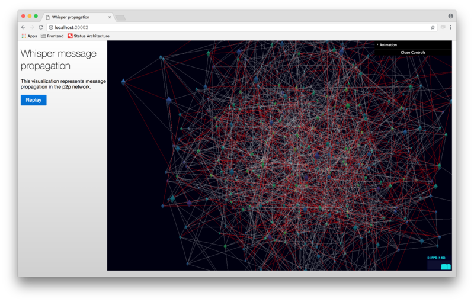

# WhisperVis
Whisper message propagation visualization.

# Intro
This tool visualizes message propagation in a p2p network using WebGL and helps building intuition about Whisper behaviour in different networks and/or settings.

It takes two files as an input:

 - `network.json` - network topology description, usually generated with [graph_generator](https://github.com/divan/graphs-experiments/tree/master/cmd/graph_generator) tool.
 - `propagation.json` - propagation log, obtained via running [Whisper simulation tool](https://github.com/status-im/simulation).

# Installation

Assuming, you have Go installed and set up (why would you not?), just run:

`go get github.com/status-im/whispervis`

# Usage

Place `network.json` and `propagation.json` into the folder with binary, and run it.

`./whispervis`

The output will show the URL where you should point your browser in order to see the visualization.

# Contributing

Project consists from two parts – Go backend and JS frontend, communicating via WebSockets.

If you make a change in the frontend, you'll have to do a couple of things:

  1. `cd web/ && npm install`
  2. Run `go generate` to update the `bundle.js` which is used by the backend to serve a page.

# License

MIT

